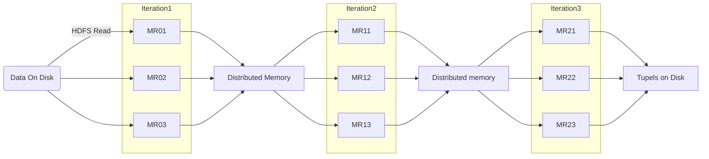

# Spark

- SPark RDD - Resiliant Distributed Dataset
  > Resilient Distributed Datasets (RDD) is a fundamental data structure of Spark. It is an immutable distributed collection of objects. Each dataset in RDD is divided into logical partitions, which may be computed on different nodes of the cluster. RDDs can contain any type of Python, Java, or Scala objects, including user-defined classes.



## RDD

Untyped data.

Example taken from: [TutorialsPoint](https://www.tutorialspoint.com/apache_spark/apache_spark_core_programming.htm)

```Scala
val inputfile = sc.textFile("input.txt")
// Our aim is to count the words in a file. Create a flat map for splitting each line into words (flatMap(line ⇒ line.split(“ ”)).
// Next, read each word as a key with a value ‘1’ (<key, value> = <word,1>)using map function (map(word ⇒ (word, 1)).
// Finally, reduce those keys by adding values of similar keys (reduceByKey(_+_))
// The following command is used for executing word count logic. After executing this, you will not find any output because this is not an action, this is a transformation; pointing a new RDD or tell spark to what to do with the given data)
val counts = inputfile
    .flatMap(line => line.split(" "))
    .map(word => (word, 1))
    .reduceByKey(_+_);
// While working with the RDD, if you want to know about current RDD, then use the following command. It will show you the description about current RDD and its dependencies for debugging.
counts.toDebugString
// You can mark an RDD to be persisted using the persist() or cache() methods on it. The first time it is computed in an action, it will be kept in memory on the nodes. Use the following command to store the intermediate transformations in memory.
counts.cache()
```

- RDD is resiliant using a lineage graph (DAG) for recompilation
- Distributed - over a number of nodes
- Datasets - multuple records
- immutable
- Primarily in memory (unless too large)
- Stores provenance from other RDDs or external (imported) sources
- Unstructured data
- You want to manipulate your data with functional programming constructs than domain specific expressions;
- you don’t care about imposing a schema, such as columnar format, while processing or accessing data attributes by name or column; and
- you can forgo some optimization and performance benefits available with DataFrames and Datasets for structured and semi-structured data.

[Comparison of RDD, DataFrames and DataSets](https://databricks.com/blog/2016/07/14/a-tale-of-three-apache-spark-apis-rdds-dataframes-and-datasets.html)

## DataFrames

- Merged with DataSets from Spark 2
- DataFrame is a `DataSet<Row>` where Row is a generic Row object
- A DataSet is `DataSet<T>`

## Examples

Reading from a JSON file

```Scala
case class DeviceIoTData (
  battery_level: Long,
  c02_level: Long,
  cca2: String,
  cca3: String,
  cn: String,
  device_id: Long,
  device_name: String,
  humidity: Long,
  ip: String,
  latitude: Double,
  lcd: String,
  longitude: Double,
  scale:String,
  temp: Long,
  timestamp: Long)

// read the json file and create the dataset from the
// case class DeviceIoTData
// ds is now a collection of JVM Scala objects DeviceIoTData
val ds = spark.read.json(“/databricks-public-datasets/data/iot/iot_devices.json”).as[DeviceIoTData]

// Use filter(), map(), groupBy() country, and compute avg()
// for temperatures and humidity. This operation results in
// another immutable Dataset. The query is simpler to read,
// and expressive

val dsAvgTmp = ds.filter(d => {d.temp > 25}).map(d => (d.temp, d.humidity, d.cca3)).groupBy($"_3").avg()

//display the resulting dataset
display(dsAvgTmp)
```

## Type Hints

- [PySpark Stubs](https://github.com/zero323/pyspark-stubs) coming to Spark 3.1
-
